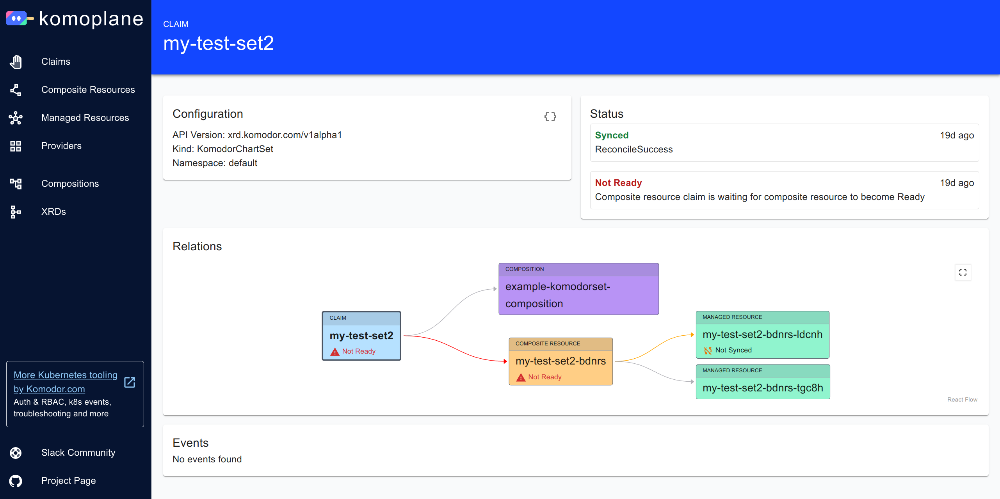

#  

[Komodor's](https://komodor.com) Crossplane Tool is a project to experiment with
visualizing [Crossplane](https://www.crossplane.io/) resources. The goal is to help Crossplane users to understand the
structure of their control plane resources and speed up troubleshooting.

<kbd>[](examples/screenshot1.png)</kbd>

## Installation

The primary way of installing _komoplane_ is by installing the corresponding Helm chart:

```shell
helm repo add komodorio https://helm-charts.komodor.io \
  && helm repo update komodorio \
  && helm upgrade --install komoplane komodorio/komoplane
```

After installing, publish port `8090` from _komoplane_ pod and open it in your web browser.

By default, _komoplane_ works on port `8090`, you can change that via `extraArgs` Helm value.

### Running Without Installing

It is possible to run _komoplane_ locally as a binary process. To do so, download standalone binary
from [Releases](https://github.com/komodorio/komoplane/releases). Use `KUBECONTEXT` env variable to point to different context of your kubeconfig.

## Support & Community

We have two main channels for supporting the _komoplane_ users: 
[Slack community](https://komodorkommunity.slack.com) for general conversations (`#komoplane` channel)
and [GitHub issues](https://github.com/komodorio/komoplane/issues) for real bugs.

If you want to contribute some code to the project, consider looking at [roadmap](Roadmap.md) document with some of the ideas for improvements. Also, you may search for `TODO` and `FIXME` marks in the source code for smaller technical issues to solve. The [GitHub issues list](https://github.com/komodorio/komoplane/issues) might also have some items for potential contribution.

[Contributing doc](Contributing.md) contains instructions on how to setup dev environment.

## More Kubernetes Tooling

The _komoplane_ is an Open Source project founded by [Komodor](https://komodor.com). There are some more k8s-related tools by Komodor for you:
 - [Helm Dashboard](https://github.com/komodorio/helm-dashboard) - a GUI-based operations with Helm charts
 - [validkube](https://validkube.com/) - a service to validate Kubernetes manifests for security and best practices
 - [Kubernetes Operations Platform](https://app.komodor.com/#mode=signUp) - freemium all-in-one platform to operate k8s clusters with builtin monitoring & costs analysis
